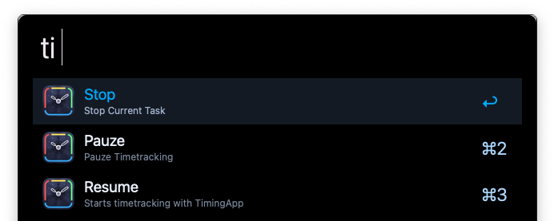

# timeFred
Alfred integration for the macOS App TimingApp

# Options
timeFred can:
- Pause Timetracking
- Resume Timetracking
- Stop the current trackt task

# ToDo
- [ ] Add option to Create/Start Task
- [ ] Start (recently used) Task
- [ ] Show tracked time options

# Was this helpfull?
Did you find any of this usefull? Consider buying me a coffe over at [BuyMeACoffee](https://www.buymeacoffee.com/cabenstein)

